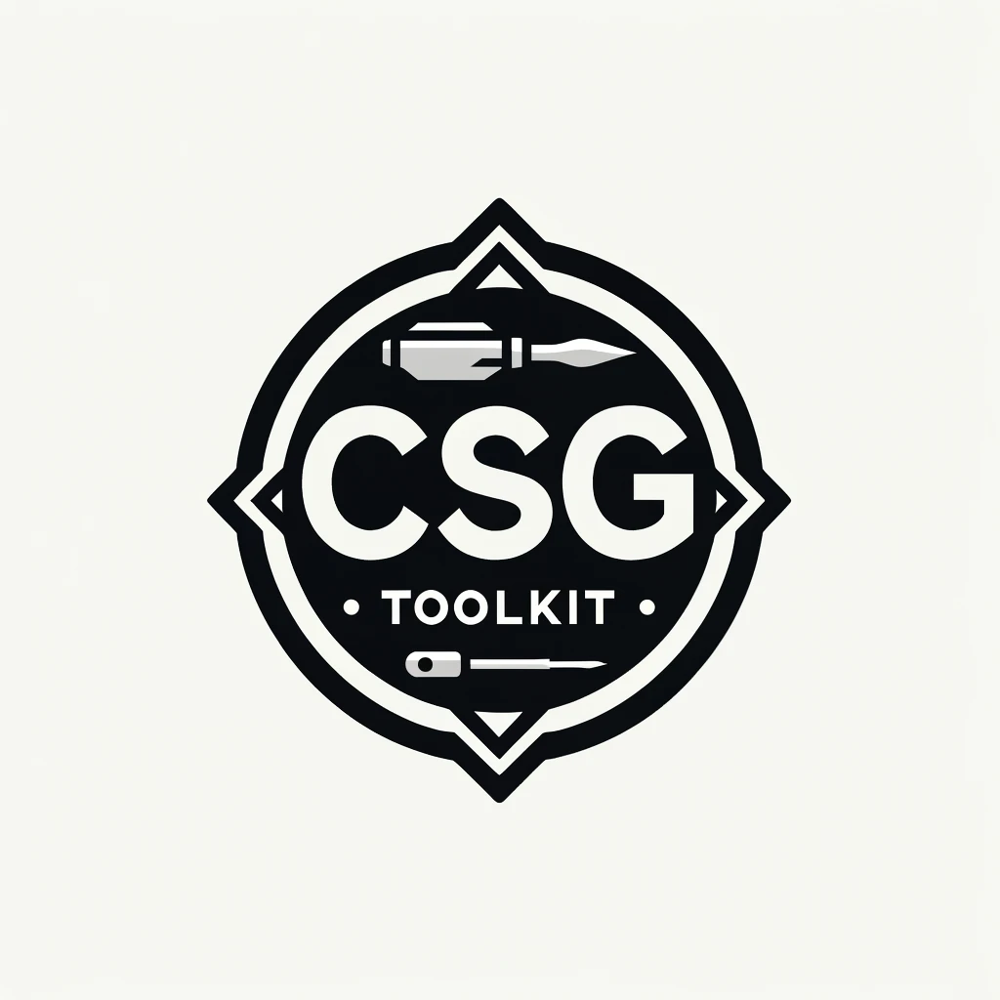
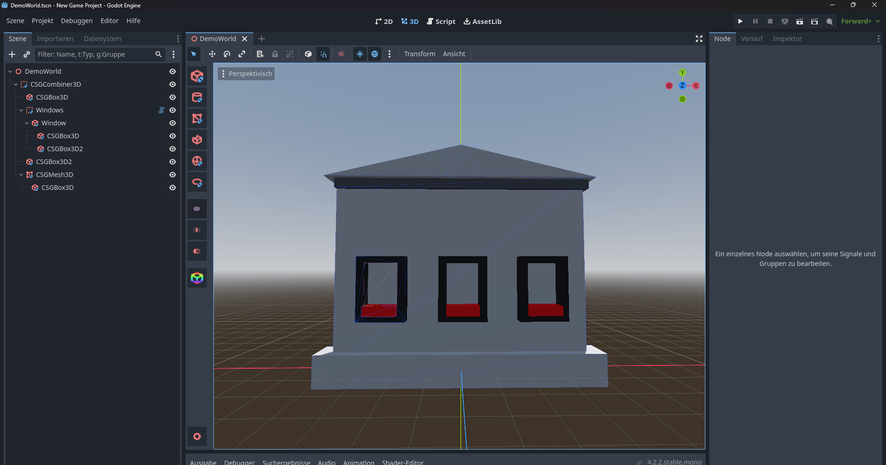

# CSG Toolkit - Enhanced Blockout & Procedural Generation
A powerful Godot plugin that dramatically speeds up your blockout workflow and adds advanced procedural generation capabilities for level design and prototyping.
 <a href="https://godotengine.org/asset-library/asset/3057">>> Asset Library </a>

## Core Features
* **Quick Access Buttons:** Convenient buttons in the left toolbar for swiftly adding CSG nodes.
* **Efficient Child Node Addition:** Press SHIFT to instantly add the selected CSG as a child of the current CSG node.
* **Operation Presets:** Easily switch between different CSG operations (Union, Intersection, Subtraction).
* **Material Picker:** Quickly apply materials to CSG nodes with visual preview.
* **Shortcut Integration:** Context-aware shortcuts available when CSG nodes are selected.

## Advanced Procedural Nodes

### CSGRepeater3D - Pattern Generation System
Create complex repeating patterns with multiple layout options:

**Pattern Types:**
* **Grid Pattern:** Traditional XYZ grid layout with customizable spacing
* **Circular Pattern:** Objects arranged in circles with optional vertical layers  
* **Spiral Pattern:** Objects follow a configurable spiral path
* **Random Grid:** Grid positions with randomized placement order

**Advanced Controls:**
* **Variation Controls:** Random rotation, scale, and position jitter
* **Seed-Based Generation:** Reproducible random patterns

### CSGSpreader3D - Intelligent Object Distribution
Distribute objects naturally within 3D shapes with smart placement:

**Supported Shapes:**
* **Box, Sphere, Cylinder, Capsule:** Standard primitive shapes
* **HeightMap:** Surface-following distribution
* **Convex/Concave Polygons:** Complex geometry support
* **World Boundary:** Large area distribution

**Smart Features:**
* **Collision Avoidance:** Prevent object overlap with configurable minimum distances
* **Noise Threshold:** Control density and distribution patterns
* **Advanced Random Distribution:** Mathematically correct uniform distribution
* **Material Variations:** Random materials and scaling options

## Quick Start Guide

1. **Enable the Plugin:** Project Settings > Plugins > CSG Toolkit ✓
2. **Add Nodes:** Create Node > CSGRepeater3D / CSGSpreader3D / CSGModifier3D
3. **Set Template:** Assign a template node or scene to repeat/spread
4. **Configure Pattern:** Choose pattern type and adjust parameters

### Installation Note
After installing the plugin, reload your project and enable it in Project Settings > Plugins. 
 

 
 
Made with coffee and ♥

